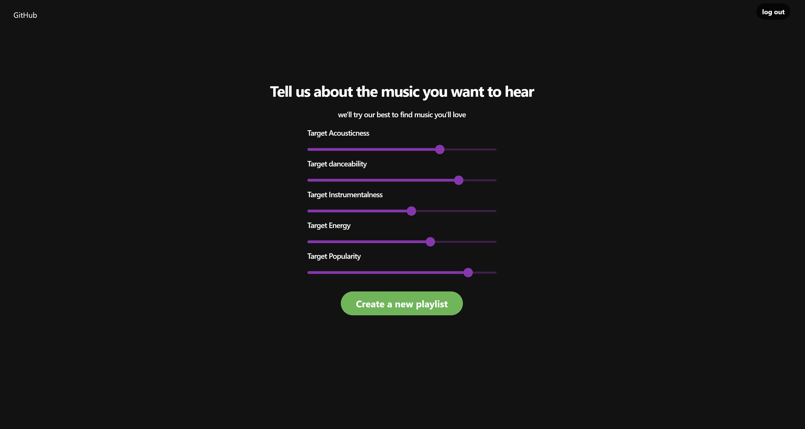

# Discover More Music
Discover More Music is a Node.js and React based web application that uses your Spotify listening data to create a new playlist for you.

# Features
- Utilizes Spotify's support for OAuth 2.0 to securily send and recive user data.
- Utilizes Spotify's get reccomendations web api function generate song recomendations based on seeded songs and artists.
  - Uses user listening data for seed songs and artists.
  - Uses frontend input for target acousticness, dancability, instrumentalness, energy, and popularity.
- Creates a new playlist with the users account of the reccomended songs

